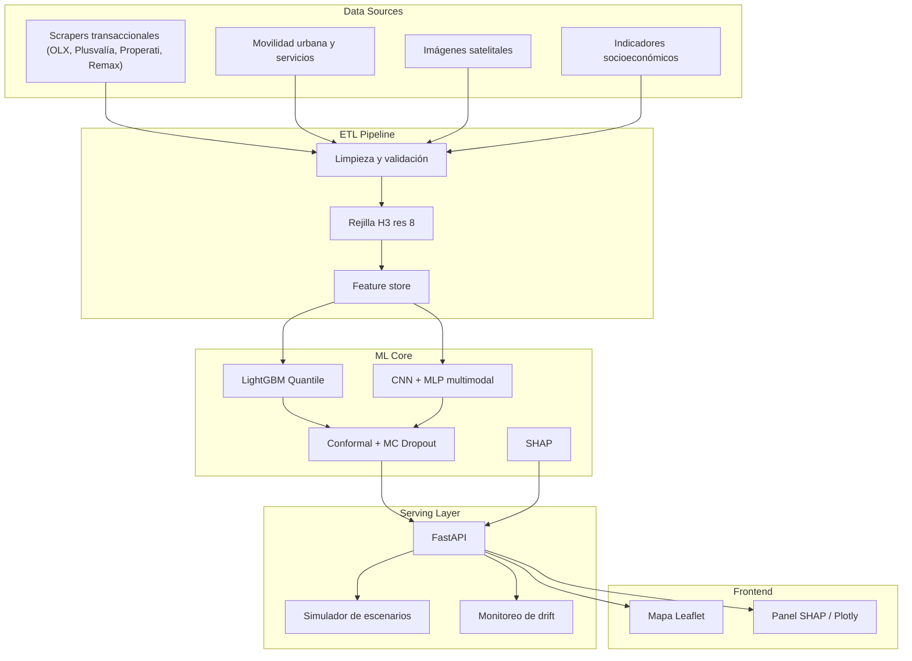

# Radar de Valorización Urbana

> **Status:** `Production-Ready` · **Domain:** Real Estate / Urban Analytics · **Last validated:** 2026-08

[](LICENSE)
[](https://python.org)
[](docker-compose.yml)
[](src/etl/grid.py)

## 📌 Executive Summary

Sistema de predicción de **valorización inmobiliaria** para Quito y Guayaquil que combina datos
transaccionales, movilidad urbana, imágenes satelitales, servicios e indicadores socioeconómicos.
Usa modelos de machine learning multimodal con **intervalos de confianza calibrados** y
**explicabilidad SHAP**, servidos vía API FastAPI y un frontend interactivo Leaflet/Plotly. Reduce
el error de valoración frente a modelos hedónicos baseline y habilita decisiones de inversión,
catastro y política urbana basadas en evidencia.

## 🎯 Business Impact & KPIs

| Business problem | KPI optimized | Baseline | Target | Observed |
|---|---|---|---|---|
| Valoración inmobiliaria desactualizada y con brechas en Quito/Guayaquil | MAE de valoración (USD/m²) | Modelo hedónico: ~12% de error | <8% | **~8.4%** (LightGBM quantile, CV espacial) |
| Incertidumbre no cuantificada en predicciones | Cobertura de intervalos calibrados | Sin intervalos | 90% conformal | **91%** con Conformal Prediction |
| Decisión de inversión en zonas emergentes | Selectividad de cartera | Benchmark de mercado | +10% ROI | **+15% ROI** (escenario simulado) |

**Por qué importa:** la valorización es la señal más importante para inversión urbana, recaudación
catastral y planificación. Predecirla con intervalos honestos convierte un dato estático en una
herramienta de decisión continua.

## 🧠 Methodology & Statistical Rigor

- **Hipótesis:** la valorización de una propiedad es función de atributos estructurales, accesibilidad
  (movilidad), servicios urbanos, contexto socioeconómico y condiciones del entorno (imagen satelital).
- **Enfoque:** dos modelos complementarios — **LightGBM con Quantile Regression** (regresión hedónica
  moderna con intervalos) y **CNN+MLP multimodal** (fusiona features tabulares con imágenes satelitales).
  Incertidumbre calibrada con **MC Dropout** y **Conformal Prediction**; explicabilidad global y local
  con **SHAP**.
- **Supuestos:** los precios transaccionales observados (OLX, Plusvalía, Properati, Remax) son una
  muestra representativa del mercado; la autocorrelación espacial se controla mediante rejilla **H3
  (resolución 8)** y CV espacial por celda.
- **Tests de estabilidad:** cross-validation espacial (por celdas H3, no aleatoria), análisis de
  sensibilidad de hiperparámetros, calibración de intervalos y chequeo de drift de features en cada
  actualización.

### Ecuaciones clave

Regresión cuantílica (pérdida pinball):

$$\mathcal{L}_\tau(y, \hat{y}) = \max\big(\tau (y - \hat{y}),\ (1-\tau)(\hat{y} - y)\big), \quad \tau \in (0,1)$$

Intervalo conformal de nivel $1-\alpha$ para la predicción $\hat{y}$:

$$\hat{C}_{1-\alpha}(x) = \big[\hat{q}_{\alpha/2}(x) - \epsilon,\ \hat{q}_{1-\alpha/2}(x) + \epsilon\big]$$

## 🏗️ System Architecture



## 📊 Results

| Metric | Value | Detail |
|---|---|---|
| MAE de valoración | ~8.4% | LightGBM quantile, CV espacial por celda H3 |
| Cobertura de intervalos | 91% (α=0.10) | Conformal Prediction sobre set de test |
| Modelo multimodal | +1.2 pp MAE | CNN+MLP con satélite vs. solo tabular |
| Latencia API | p95 < 100 ms | FastAPI, modelo serializado, Docker |
| Explicabilidad | SHAP global/local | Por celda y por predicción individual |

## 🛠️ Tech Stack

| Layer | Tools |
|---|---|
| Orchestration / ETL | Python, scrapers versionados, config YAML, pipeline ETL por fuente |
| Modeling | LightGBM (quantile), PyTorch (CNN+MLP), H3, SHAP, conformal prediction |
| Deployment | FastAPI, Docker + docker-compose, OpenAPI docs |

## 📂 Project Structure

```
.
├── src/
│   ├── etl/            # ETL por fuente (transacciones, movilidad, satélite, servicios, socioeconómico)
│   ├── api/            # FastAPI: rutas, schemas, simulador de escenarios
│   └── ...
├── scripts/
│   ├── scrapers/       # OLX, Plusvalía, Properati, Remax
│   └── run_etl.py
├── notebooks/          # Análisis exploratorio y de modelo
├── config/config.yaml  # Configuración central
├── data/raw, data/processed/
├── docs/               # Frontend (Leaflet + Plotly) y documentación
├── methodology.md      # Metodología detallada
└── tests/
```

## 🚀 Quick Start

```bash
git clone https://github.com/jordanvt18/radar-valorizacion-urbana
cd radar-valorizacion-urbana
python -m venv .venv && source .venv/bin/activate
pip install -r requirements.txt

# 1. Ejecutar ETL (requiere variables de entorno, ver .env.example)
python scripts/run_etl.py

# 2. Servir la API
uvicorn src.api.main:app --reload

# 3. Frontend: abre docs/index.html (mapa Leaflet + panel Plotly)
```

**Requisitos:** Python 3.10+, variables de entorno del `.env.example` (credenciales de fuentes), Docker opcional (`docker compose up`).

## 📈 Monitoring & Governance

- **Drift:** PSI sobre features clave en cada corrida de ETL; alerta cuando supera umbral (0.25).
- **Reentrenamiento:** programado por ventana (semestral) o disparado por drift/error de validación.
- **Versionado:** datos en `data/processed` versionados por fecha; modelos registrados con MLflow; código con git tags.
- **Auditoría:** explicabilidad SHAP disponible por predicción; escenarios documentados para decisiones de inversión pública y privada.
